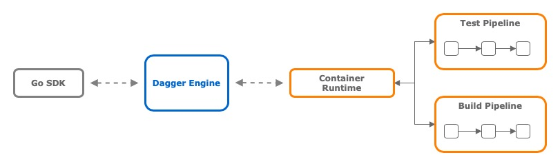
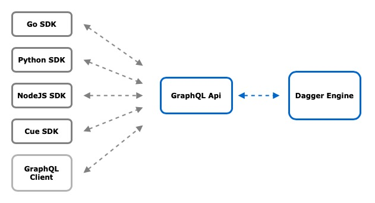

# Introduction to Dagger

Here at [PlaygroundTech](https://playgroundtech.io), we love exploring new technologies and tinkering with tools that can enhance our development workflow. We're constantly experimenting with innovative solutions and techniques to stay ahead of the curve and ensure that our work is enjoyable, efficient, and impactful for our customers.

I recently came across a new tool called [Dagger](https://dagger.io) and after introducing it to the team, they were was so impressed with it that we decided to write a blog post about it.

For this post, I explored Dagger using the **Go SDK** and I created example Github [repository]() for everyone.

The example hosts a small Chat GPT generated dummy application written in Go and a test to go along with it. The application can be containerized and we will be using Github Actions to test, build and push the application to a public registry. Showing off the basics of Dagger and some of the magic behind it.

---

## Prelude

If you're currently working with YAML-based CI/CD pipelines, chances are you've had to switch between different systems at least once in your career. It could be from CircleCI to Github Actions or something else. Then you know how potentially tedious and time-consuming it can be to refactor all of your carefully crafted YAML pipeline code into a new syntax.

You're part of a team of SRE's or developers who mainly work in Go, where developers write pipelines in YAML for their applications and SRE's provide reusable pipeline blueprints as building blocks.

You and your team have been tasked with switching you entire CircleCI pipeline system to Github Actions. This includes all the pipelines and Orbs that the rest of the organization have been using.

So, you start by reading through the reference documentation. Trying to figure out how to recreate your current pipeline-as-code configuration into something Github Actions understands. On top of that you need to figure out how to convert CircleCi Orbs in Actions.

Then, after learning the syntax, many trials and errors, making dummy commits and pushing to a branch just to trigger the pipeline. Checking that various conditions invoke your jobs and steps, and making sure outputs propagate and exit codes either pass or fail those builds. You finally have a working pipeline that tests, builds, and deploys your product. Woohoo :tada: :tada: :tada:

But how long did this refactoring take? Time that you could spend on actual pruduct development. And how much time will you now need to spend teaching the rest of the company about how to write and use Github Actions?

1. Wouldn't it be better if you didnt need fully learn a syntax that the new CI/CD engine understands?
2. Wouldn't it be awesome if you could write your pipeline directly in an actual programming language, like **Golang**?
3. Even better, what if the pipeline was environment-agnostic, and portable between CI/CD systems.
4. Supported local development without needing to install a full development environment – could you have developed most of your pipeline on your laptop instead :brain:

That's where Dagger comes in.

## What is Dagger – the pitch

So, [Dagger](https://dagger.io) is a unique and newish tool for building CI/CD pipelines as code. With Dagger, you can write pipelines in your preferred programming language and execute them as standard OCI containers.



It was created by the founder of [Docker](https://www.docker.com); Solomon Hykes and co-founders Sam Alba, Andrea Luzzardi and its a free and open-source project with alot of traction behind it.

In Dagger you write code that imports the Dagger SDK. The job of the SDK is to talk to the Dagger Engine. It does this by sending GraphQL queries and mutations to the Dagger Engine. The engine then executes the pipeline as containers and returns the results to the SDK.



Currently, Dagger supports Cue, Node.js, Python, Go, and GraphQL API out of the box. However, since all SDKs interact with the Dagger Engine using GraphQL, you could write your own SDK in any language you prefer.

# Getting Started

To get started with Dagger, you only need to have [Git](https://git-scm.com/book/en/v2/Getting-Started-Installing-Git), [Go 1.20 or later](https://go.dev/doc/install) and [Docker](https://docs.docker.com/engine/install/) installed on your host system. Read the full [getting started guides here](https://docs.dagger.io/#getting-started)

If you want to follow along, grab the source code from the example [repository]() and you should see a repo structured like this:

```
.
├── ci/
├── README.md
├── go.mod
├── main.go
└── test_main.go
```

## Summary

So, what are the benefits of using Dagger for your CI/CD pipelines? First and foremost, Dagger allows you to write your pipeline in a programming language you already know and love, rather than having to learn yet another YAML-based syntax. This can save you and your team a lot of time and frustration, as you don't have to deal with the limitations and quirks of YAML, and can leverage the full power of your programming language of choice.

Moreover, Dagger's container-based approach makes it very easy to run your pipelines locally, without having to spin up a full-blown CI/CD environment. You can simply execute your pipeline as a container on your own machine, and test it against your code changes in a matter of seconds. This can greatly speed up your development cycle and increase your confidence in your changes.

Another advantage of Dagger is that it's environment-agnostic and portable between different CI/CD systems. This means that you can write your pipeline once, and use it on any platform that supports OCI containers, without having to make any changes. This can save you a lot of headache and maintenance effort, especially if you work with multiple CI/CD systems or need to switch between them frequently.

Stop right there. By now you could be telling yourself that you already have a CI/CD system set in stone, and now you are telling me that I have to learn yet another DSL, no thanks! And by the way I love YAML. Whats wrong with my shell scripts and by the way I really dont trust containers. Well, then Dagger is probably not for you. But for all you others out there, open to trying something new, then read on.

Jokes aside, while you surely can replace big chunk of your yaml programmable parts with Dagger code. You still need to execute Go somehow, in a language that the CI/CD engine understands. What I have learned during my investigation is that I still need know the basics of Github Actions to trigger the whole process. And I can't just pass in the entire Github Context into Dagger, to handle the logic there. Because then it wouldn work locally or in another system since they use different context variables.
